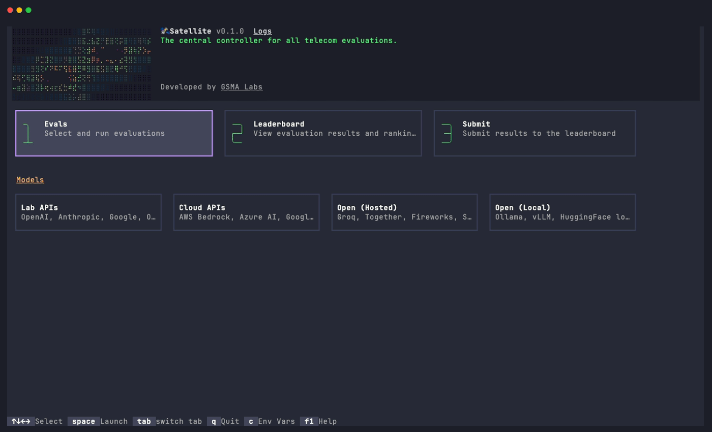

# Satetoad

**Open Telco Evaluation Suite** — A TUI for benchmarking LLMs on telecom tasks.



## Quick Start

### 1. Install uv

Satetoad uses [uv](https://docs.astral.sh/uv/getting-started/installation/) as its package manager. Install it first:

```bash
curl -LsSf https://astral.sh/uv/install.sh | sh
```

### 2. Clone and setup

```bash
git clone https://github.com/gsma-labs/satetoad.git
cd satetoad
make setup
```

`make setup` installs Python 3.13, all dependencies, and registers the `satetoad` command.

### 3. Run

```bash
uv run satetoad
```

## What You Can Do

### Run Evaluations

Run any combination of the five telecom benchmarks against your chosen model:

| Benchmark | Required Samples |
|-----------|-----------------|
| TeleQnA   | 1000            |
| TeleLogs  | 100             |
| TeleMath  | 100             |
| TeleTables| 100             |
| 3GPP      | 100             |

Track running jobs with live progress bars, cancel jobs in progress, and inspect detailed scores and token usage per job. The Settings tab lets you configure sample limits, epochs, max connections, and token limits.

Evaluation tasks are defined in [gsma-labs/evals](https://github.com/gsma-labs/evals). Traces are viewable through the integrated [Inspect AI](https://inspect.aisi.org.uk/) viewer.

### Preview Leaderboard

View the current leaderboard rankings directly in the TUI. Your local results appear alongside remote entries so you can compare before submitting.

### Submit to Leaderboard

Submit your evaluation results to [gsma-labs/leaderboard](https://github.com/gsma-labs/leaderboard) as a pull request — all from within the TUI.

## Supported Models

Satetoad supports all [Inspect-compatible model providers](https://inspect.aisi.org.uk/models.html) — including OpenAI, Anthropic, Google, Mistral, and more. Configure your model and API keys through the TUI.

## Submission Setup

To submit results, you need a GitHub token with the following permissions scoped to `gsma-labs/leaderboard`:

- `contents:read` and `contents:write`
- `pull_requests:write`

All five benchmarks must be completed with the required sample counts before submission is allowed.
